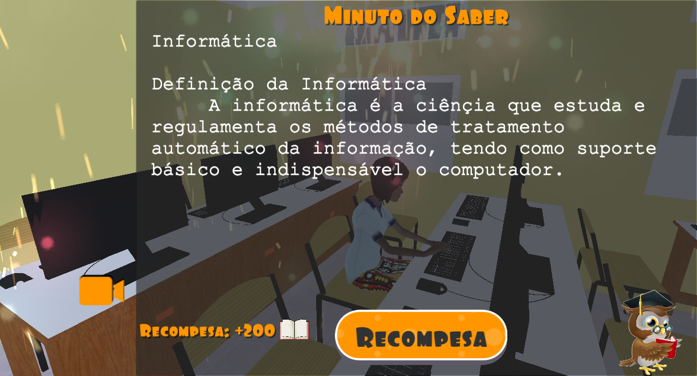

# Samari Kilapeiro

🎮A game that aims to give the student access to practical computer classes. 
🎮Um jogo que tem como finalidade levar o aluno a ter acesso as aulas praticas de informática.
## Description
- This game aims to take the debtor student (kilapeiro) to have access to a practical class in the computer laboratory. To do so, he will have to avoid meeting school security guards and collect notebooks to gain access to keys that will unlock the doors that will give you access to the payment form.
- Este jogo tem como finalidade, levar o aluno devedor (kilapeiro) a ter acesso a aula prática no laboratório de informática, para tal, ele terá de evitar encontrar-se com os seguranças da escola e coletar caderno para ter acesso a chaves que vai desbloquear as portas que lhe dará acesso a ficha de pagamento.
## 🛠Tools
- 
- 
- 
- SkecthUp;
## Layout
- Home Screens.
- Telas Iniciais.

- Game scenes.
- Cenas de jogo.

## Demo (.apk)
- Below is the link to the game's demo apk:  
[x] [Click here to download the demo on Google Drive](https://drive.google.com/file/d/1DNxAPTf2qehMEVa1T2uKKTz46rQ8B1QP/view?usp=sharing)